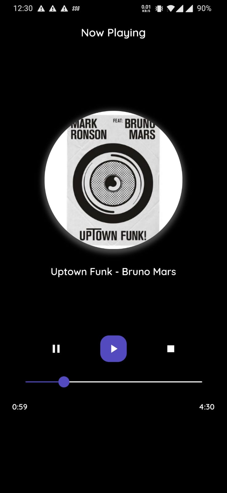

# HNRmp3

A static music player application as a test.

## Getting Started

### Pre-requisite
- Android Studio Installed, SDK path which is needed in local.properties
- Flutter SDK, path required in local.properties
- A cup of coffee and code editor for reviewing the code :)

### Clone
```
git clone https://github.com/kunjshah45/hnr_flutter.git
```

### Install external Packages

This command should take care of external libraries used.

```
flutter pub get
```

### Running the code

Connect your device and run the commands below, please make sure basic permissions are given for letting flutter install the app on the device.

#### Run on device - Gives hot reload, easy to tweek the code and check the changes.
```
flutter run
```

#### Install on device
```
flutter install
```

#### Generate Release APK

Make sure keystore is generated before following the below steps and key.properties file is created in android/ folder which basically specifies location for *key.jks*

```
flutter build apk
```

# Results



### Build APK
[Apk File](build/app/outputs/apk/release/app-release.apk)